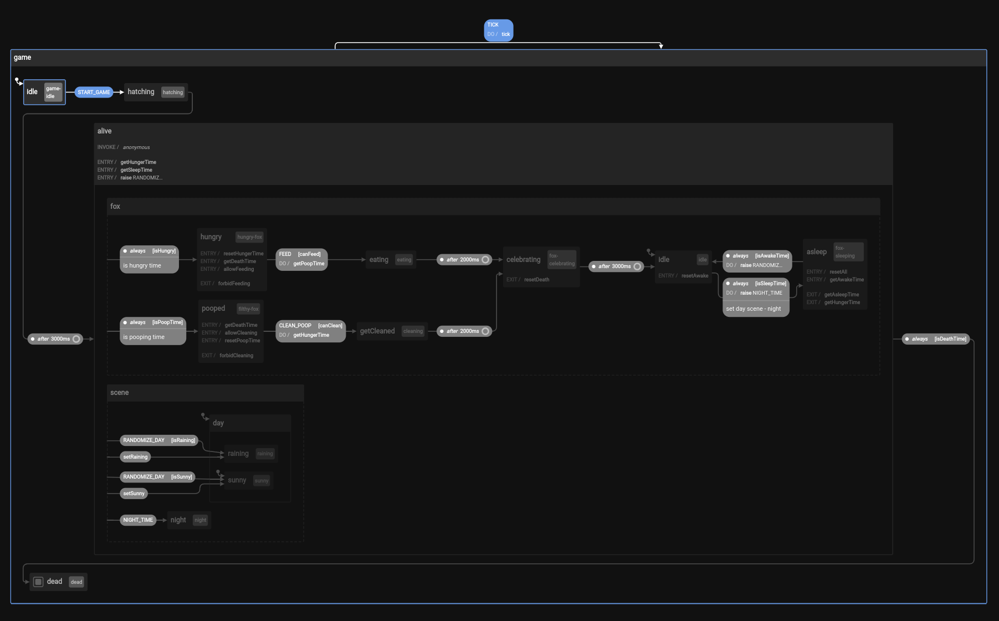

# [Fox Game](https://github.com/btholt/project-fox-game-site) remake with x-state
A fox game made in vanillaJs `src/old.gameState.js` then remade using [x-state](https://xstate.js.org/). 


<div align="center">
    
</div>


## [Demo Link](https://reikrom-foxgame-xstate.netlify.app/)
[](https://app.netlify.com/sites/reikrom-foxgame-xstate/deploys)
### Or run locally
```
yarn
yarn dev
```